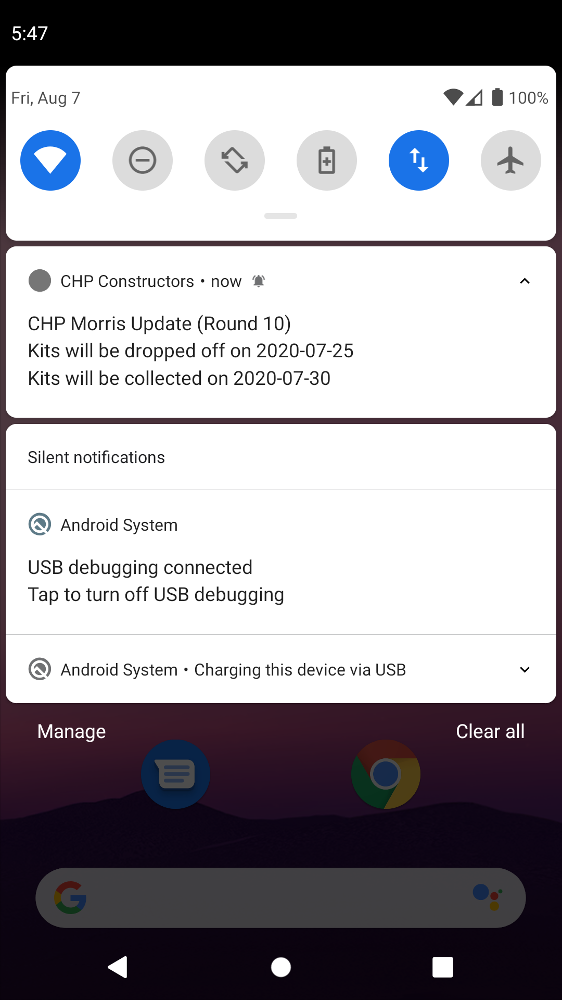
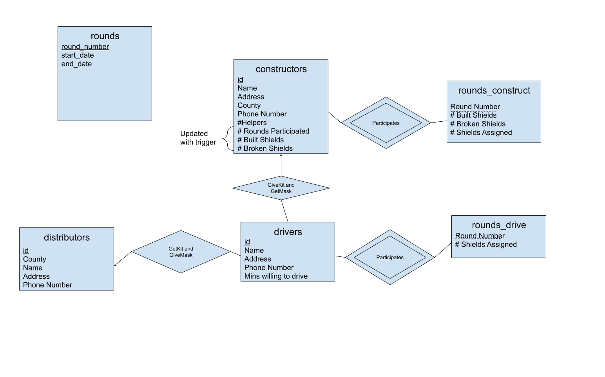
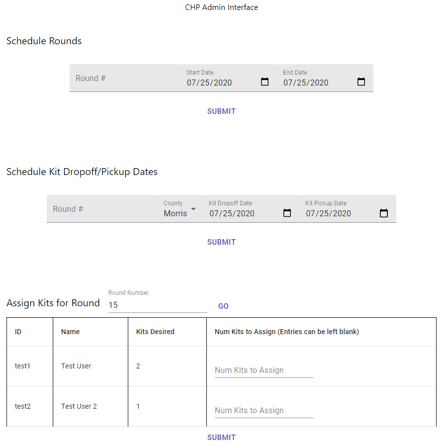

# Common Health Project
This repository contains a mobile app in React Native (IOS/Android) and a React admin interface for coordinating the construction of face shields in New Jersey. 

The app development lead is Asher Gilani and the lead designer is Sarah Ryu. The project has been in operation for 3 months and has created over 10,000 face shields. Visit our [website](https://commonhealthproject.com/) for more details.

# App Overview
### Signup/Login System with Firebase

- Firebase takes care of caching login credentials to prevent constant logging in
- Valid emails are required

### Live Notifications

- Notifications can be sent out through the admin interface using the Firebase SDK and Firebase Cloud Messaging
- Notifications tell users when to expect kits to be dropped off and picked up for each county

### Construction Tutorial

- Step by step tutorial is shown above
- There are also external Youtube videos for further construction assistance

### Face Shield Submission

- Users must first complete final quality checklist
- Then they can submit the shields through a Google Form (temporary)
- They are then greeted with a congratulations screen

# Backend Overview
### Completely Serverless
- Uses AWS API Gateway/Lambda Functions written in Python 3.8
- Deploys to the cloud from a CloudFormation template
- I wrote a custom script for easily adding to the CloudFormation template

### Uses an AWS Aurora (Postgres) Database

- Database schema is normalized in 4NF (no multi-valued functional dependencies)
- Uses a DB trigger to keep global constructor statistics about the number of shields built and broken
- Backend uses AWS Secrets Manager to securely connect to the DB

# Admin Interface Overview

- UI is not complete, it is extremely basic right now
- Built in React with Material UI and functional components
- Deploys [here](https://gilaniasher.github.io/common-health-project/) using Github Pages (login credentials are required)
